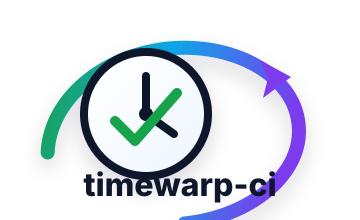
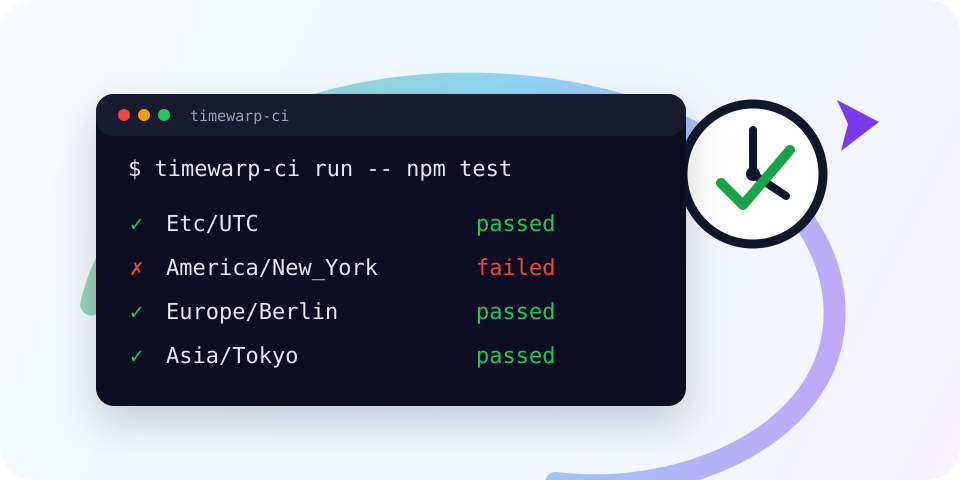
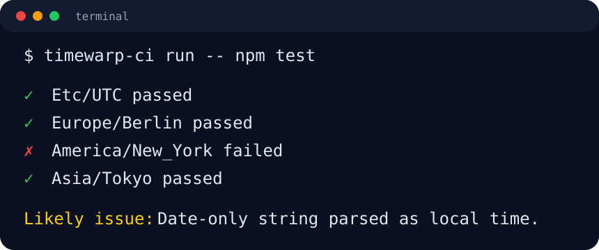

<p align="center">
  
</p>

<h1 align="center">timewarp-ci</h1>

<p align="center">
  Run your tests through time.
</p>

<p align="center">
  Catch timezone, DST, leap-day, month-end, and year-end bugs before production.
</p>

<p align="center">
  <a href="https://www.npmjs.com/package/timewarp-ci"></a>
  
  <a href="./LICENSE"></a>
  
</p>

<p align="center">
  
</p>

## Why Time Bugs Escape

Date bugs often pass on one laptop and fail somewhere else: a CI runner in UTC,
a customer in New York, a deploy near month-end, or code that quietly treats a
date-only string as local time.

timewarp-ci is an open-source TypeScript CLI for finding those failures earlier.
The current `v0.3.0` scope runs your test command across a timezone matrix by
setting `TZ` environment variables, with optional JSON config, JSON reports, and
GitHub Actions annotations.
It does not claim to globally change system time.

## Quick Start

Current local development commands:

```sh
npm install
npm run dev -- --help
npm run dev -- --version
npm run dev -- run -- npm test
npm run dev -- run -t Etc/UTC -t Europe/Berlin -- npm test
```

After building, you can run the compiled CLI directly:

```sh
npm run build
node dist/cli.js --help
```

Package usage is intended to support `npx timewarp-ci` once the package is
published.

## Demo Output

The timezone matrix runner uses `TZ` environment variables for each child
process.

<p align="center">
  
</p>

```txt
timewarp-ci run -- npm test

PASS Etc/UTC           passed
FAIL America/New_York  failed
PASS Europe/Berlin     passed
PASS Asia/Tokyo        passed
```

## Why This Exists

Most test suites run in one timezone. Production does not.

timewarp-ci is meant to make timezone and calendar-sensitive testing boring:
simple commands, deterministic output, CI-friendly failures, and no hidden
telemetry. The project starts small so every release can be useful and honest.

## Features

| Status | Feature |
| --- | --- |
| Available in `v0.0.1` | TypeScript CLI package seed |
| Available in `v0.0.1` | `timewarp-ci --help` |
| Available in `v0.0.1` | `timewarp-ci --version` |
| Available in `v0.1.0` | Run a test command across a timezone matrix using `TZ` |
| Available in `v0.2.0` | JSON config files and JSON report output |
| Available in `v0.3.0` | GitHub Actions annotation output |
| Planned | Diagnostics, static date-risk scanning, fixed-date mode, and ecosystem adapters |

## GitHub Actions

The runner can be used in a standard Node workflow once the package is
published:

```yaml
name: timewarp-ci

on:
  pull_request:
  push:
    branches: [main]

jobs:
  timezone-tests:
    runs-on: ubuntu-latest
    steps:
      - uses: actions/checkout@v4
      - uses: actions/setup-node@v4
        with:
          node-version: 20
      - run: npm ci
      - run: npx timewarp-ci run --report github -- npm test
```

## Configuration

Create `timewarp-ci.config.json` for repeated local and CI usage:

```json
{
  "timezones": [
    "Etc/UTC",
    "America/New_York",
    "Europe/Berlin",
    "Asia/Tokyo"
  ],
  "command": "npm test"
}
```

Then run:

```sh
timewarp-ci run
```

You can also pass a custom config path:

```sh
timewarp-ci run --config ./timewarp-ci.config.json
```

Explicit CLI timezones override config timezones:

```sh
timewarp-ci run --config ./timewarp-ci.config.json -t Etc/UTC -- npm test
```

## Reports

Text output is the default. Use JSON output for machine-readable CI logs:

```sh
timewarp-ci run --report json -- npm test
```

Use GitHub output for workflow annotations on failed timezones:

```sh
timewarp-ci run --report github -- npm test
```

Example JSON report:

```json
{
  "command": "npm test",
  "results": [
    {
      "timezone": "Etc/UTC",
      "status": "passed",
      "exitCode": 0,
      "durationMs": 1200
    }
  ]
}
```

<details>
<summary>Current CLI help</summary>

```txt
timewarp-ci

Usage:
  timewarp-ci [--help]
  timewarp-ci --version
  timewarp-ci run [--config <path>] [--report <format>] [--timezone <tz>] -- <command>
  timewarp-ci run [--config <path>]

Options:
  --help             Show this help message.
  --version          Show the installed version.
  -c, --config       Use a config file.
  --report           Output format: text, json, or github.
  -t, --timezone     Add a timezone to the run matrix.

Examples:
  timewarp-ci run -- npm test
  timewarp-ci run --config timewarp-ci.config.json
  timewarp-ci run -t Etc/UTC -t Europe/Berlin -- npm test
```

</details>

## Supported Ecosystems

| Ecosystem | Status | Notes |
| --- | --- | --- |
| JavaScript / TypeScript / Node | Initial runner | First target ecosystem |
| GitHub Actions | Initial support | Use `--report github` for failure annotations |
| Playwright | Planned | Adapter planned after fixed-date mode |
| Python / pytest | Planned | Beta later in the roadmap |
| JVM / Go | Planned | Beta later in the roadmap |

## Roadmap

See the full [ROADMAP.md](./ROADMAP.md).

Near-term milestones:

- `v0.0.1`: project seed
- `v0.1.0`: timezone matrix runner
- `v0.2.0`: config and reports
- `v0.3.0`: GitHub Actions annotation output

## Limitations

- `v0.1.0` uses timezone matrix testing through `TZ` environment variables.
- Some platforms, runtimes, or tools may ignore `TZ`; verify behavior for the
  test runner you use.
- timewarp-ci does not globally change system time.
- Fixed-date mode is not implemented yet; it is on the roadmap.
- No telemetry is included.

## Contributing

Contributions should keep the project small, deterministic, and easy to run
locally. Start with [CONTRIBUTING.md](./CONTRIBUTING.md), and keep README
examples accurate when behavior changes.

## License

[MIT](./LICENSE)
